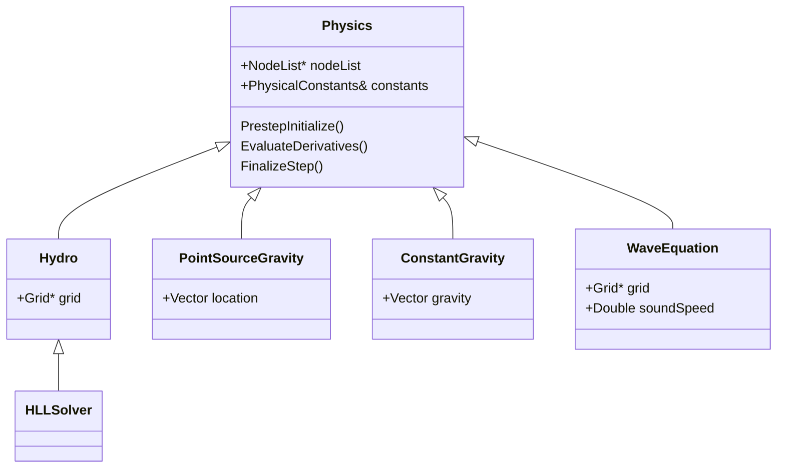

# nidhoggr

```
                               
     _   _ _                  
 ___|_|_| | |_ ___ ___ ___ ___
|   | | . |   | . | . | . |  _|
|_|_|_|___|_|_|___|_  |_  |_|  
      v0.5.0      |___|___|    

git pull
git submodule update --init --recursive

mkdir build

Nidhoggr/
|-- src/
|   |-- Math/
|   |   |-- vectorMath.cc
|   |   |-- vectorMath.py
|   |   |-- ...
|   |-- ...
|-- tests/
|-- build/

inside build directory->
cmake ..
make

```


