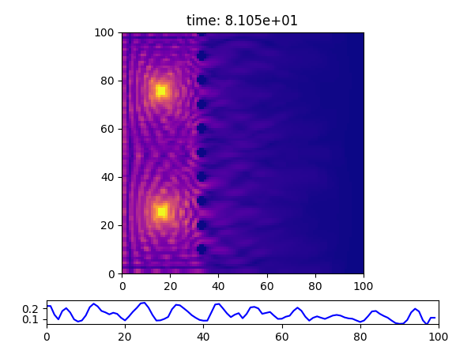
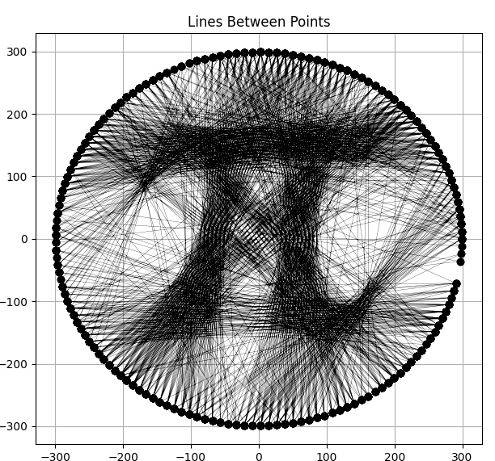
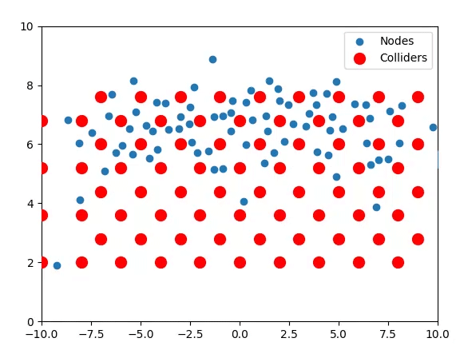

Examples
========

The ``examples`` folder holds Python runscripts that each solve a particular physics or math problem.

cherenkov.py
-----------------
Simulates a supersonic (or superluminal) point source moving through a medium at a speed greater than c.

.. image:: cherenkov.png
   :width: 40%
   :align: center

diffractionGrating.py
---------------------
Simulates the transmission of an acoustic wave through a diffraction grating.

doubleSlit.py
---------------------
Simulates a double slit experiment. 

.. image:: doubleSlit.gif
   :width: 80%
   :align: center

imageToStringArt.py
---------------------
Creates the instructions for (and previews) an image made from strings stretched across a wheel with a chosen number of pins.

plinko.py
-----------------
Simulates the Plinko game.

rps.py
-----------------
Simulates the destruction of chemical mixtures in a rock-paper-scissors-like reaction setup, where A->B->C->A. In this case,
A is blue, B is green, and C is red.

.. image:: rps.gif
   :align: center

tsunami.py
-----------------
Simulates a tsunami generated by a point source off the San Francisco Bay.

.. image:: waves.png
   :width: 50%
   :align: center

waveLogo.py
-----------------
Simulates acoustic waves inside a region with Dirichlet boundary conditions arranged in a unique fashion.

.. image:: ../../examples/logo_test.png

Simple Test Cases
-----------------

Many of the Python scripts inside the ``tests`` folder stress single components of Nidhoggr, or a small subset of them. For instance, 
``waveBox.py`` tests the acoustic wave solver with a single oscillatory source in the center of a box with two openings on either end 
(using Dirichlet boundaries to create the box).
