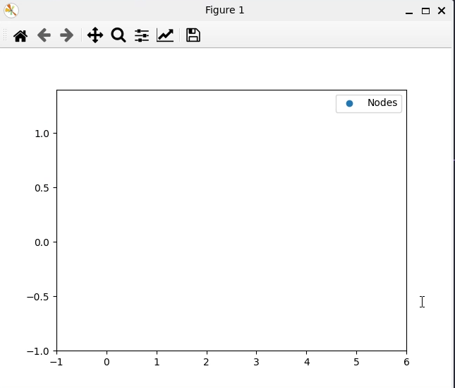

Getting Started
===============

Before proceeding, ensure that your Nidhoggr installation is working correctly by running Python interactively inside the ``tests`` directory.
Attempt to import the ``nidhoggr`` package with ``from nidhoggr import *`` and you should be greeted with the following output:

.. nidhoggr-logo::

If so, then Nidhoggr is ready to use. If not, then you'll need to troubleshoot your installation before proceeding.

First run: a simple example
---------------------------

In the ``tests`` directory, create a file called ``example.py``. In this file, we're going to write a simple script
that simulates a ball travelling along a parabolic path.

First, we import the necessary packages and we'll use the ``MKS`` class, which is a convenient way to 
define units of length (meters), mass (kilograms) and time (seconds). We also want to create the ball data structure, which
in this case is a Nodelist with a single node.

.. literalinclude:: getting_started.py
   :language: python
   :end-before: Node_created
   :linenos:

Next, we want to create our physics packages, so we'll define a gravity vector pointing downwards in 2d space, and then create the constant gravity package.
In Nidhoggr, if you're using particles as simple hard spheres, it's a good idea to also construct the Kinetics package as that will ensure that the mass, radius,
and velocity fields are created and assigned to your Nodelist. Then we place both physics
packages into a convenient Python list. 

.. note::
   While mixing dimensionality is possible within Nidhoggr, it's not recommended unless you know what you're doing,
   so in this case, we'll stick to 2d space for everything.

.. literalinclude:: getting_started.py
   :language: python
   :start-after: Node_created
   :end-before: Packages_created
   :linenos:
   :lineno-start: 9

Now we create our integrator, and we'll use RK4 for this example. We'll also set the dtmin to some small value. We'll print to screen the integrator object's
signature just to verify that it was created successfully.

.. literalinclude:: getting_started.py
   :language: python
   :start-after: Packages_created
   :end-before: Integrator_created
   :linenos:
   :lineno-start: 15

.. code-block:: bash

   $ <Integrators.RungeKutta4Integrator2d object at 0x7f5770ad3770>

To create our intial conditions, we'll access the fields of our Nodelist and set the values of the 0th node to some initial state, in this case, 
a radius of 1cm and mass of 1kg.
Then we'll set the velocity to some initial value pointing up and to the right and set the position of the ball to the origin.

.. literalinclude:: getting_started.py
   :language: python
   :start-after: Integrator_created
   :end-before: Initial_conditions_set
   :linenos:
   :lineno-start: 18

Finally, we create our controller object and assign the integrator to it. Then we call the animate function on the controller, 
passing in our positions field and a frame count of 10 frames with an interval of 50 milliseconds. We'll also set the boundaries of our
animation to be (-1,6,-1,1.4). Note that these are not problem boundaries, but rather the bounding box of the animation window which has
no effect on the simulation.

.. literalinclude:: getting_started.py
   :language: python
   :start-after: Initial_conditions_set
   :linenos:
   :lineno-start: 28

We can understand these chosen boundaries by solving the simple kinematic problem of an object traveling under the influence of Earth gravity.
If we solve for the time it takes to reach apogee (where vertical velocity is zero), and plug that time into the equation for motion, we find an apogee
height of about 1.3 meters, hence setting the maximum y-value of our animation boundaries to 1.4. 

.. math::
    \begin{aligned}
    v_y &= v_{0,y} + a t\\
    v_y &= 5 - 9.8t\\
    0 &= 5 - 9.8t_a\\
    t_a &= \frac{5}{9.8}s \\
    y_a &= y_0 + v_{y,0} t_a + \frac{1}{2} a {t_a}^2\\
    y_a &\approx 1.3m\\
    \end{aligned}

If all goes well, when you run the script with ``python3 example.py`` in your command prompt, you should see an animation of the object's motion
like so:

Simply close the animation window to quit Nidhoggr. At this point, I encourage you to increase the total number of nodes and set their initial conditions
with a loop over numNodes. Try giving each node slightly different initial conditions (and positions since they are kinetic and so will collide with one another) 
and see how the animation changes!