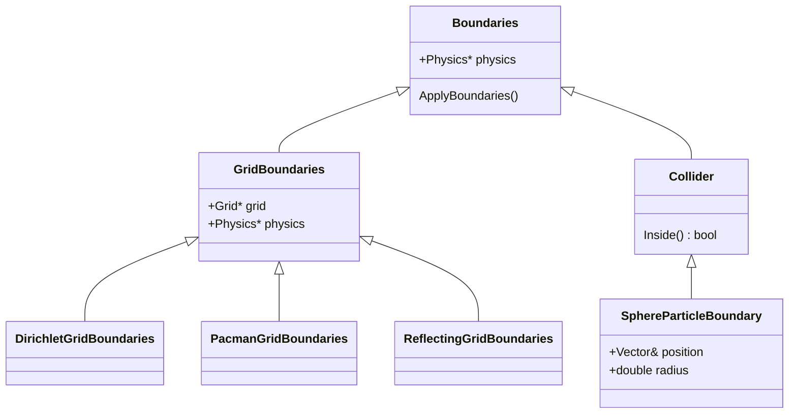

```mermaid
classDiagram
    Boundaries <|-- GridBoundaries
    Boundaries <|-- Collider
    GridBoundaries <|-- DirichletGridBoundaries
    GridBoundaries <|-- PacmanGridBoundaries
    GridBoundaries <|-- ReflectingGridBoundaries
    class Boundaries{
        +Physics* physics
        ApplyBoundaries()
    }
    class GridBoundaries{
        +Grid* grid
        +Physics* physics
    }
    class Collider {
        Inside() bool
    }
    Collider <|-- SphereParticleBoundary
    class SphereParticleBoundary {
        +Vector<dim>& position
        +double radius
    }
```