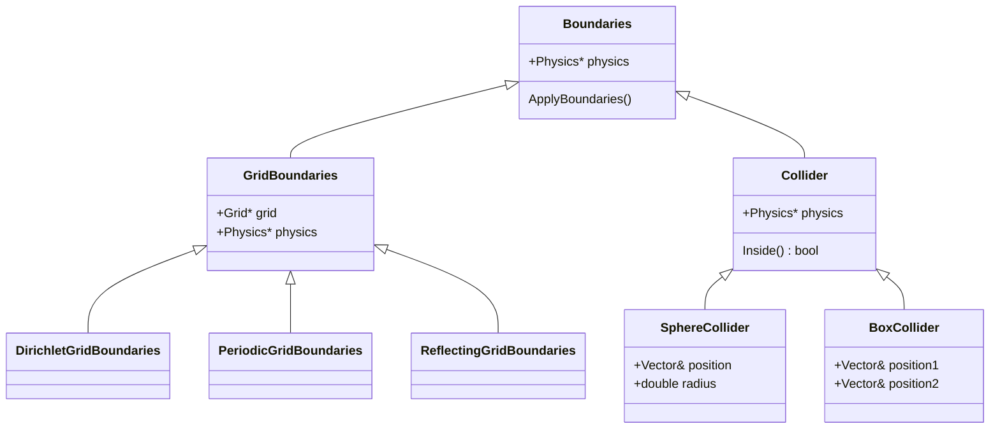

```mermaid
classDiagram
    Boundaries <|-- GridBoundaries
    Boundaries <|-- Collider
    GridBoundaries <|-- DirichletGridBoundaries
    GridBoundaries <|-- PeriodicGridBoundaries
    GridBoundaries <|-- ReflectingGridBoundaries
    class Boundaries{
        +Physics* physics
        ApplyBoundaries()
    }
    class GridBoundaries{
        +Grid* grid
        +Physics* physics
    }
    class Collider {
        +Physics* physics
        Inside() bool
    }
    Collider <|-- SphereCollider
    class SphereCollider {
        +Vector& position
        +double radius
    }
    Collider <|-- BoxCollider
    class BoxCollider {
        +Vector& position1
        +Vector& position2
    }
```