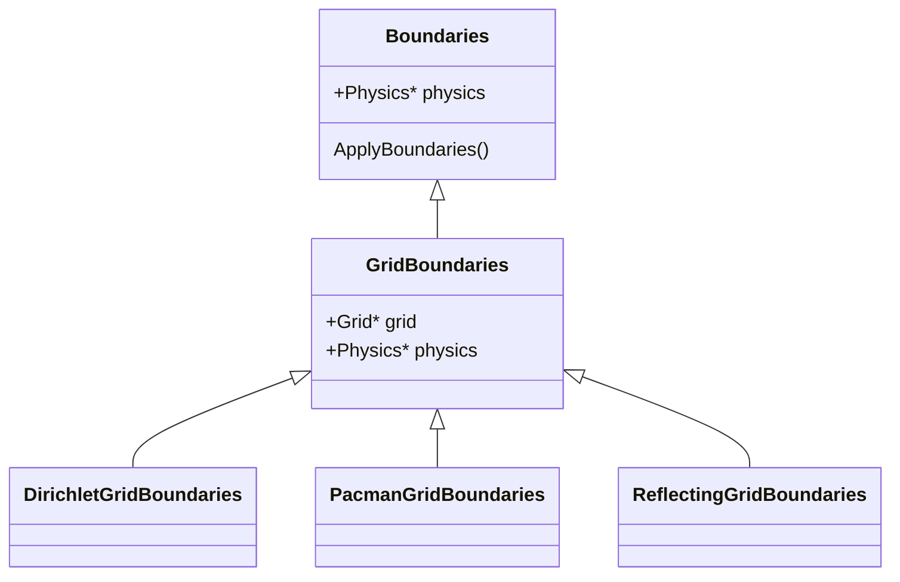

```mermaid
classDiagram
    Boundaries <|-- GridBoundaries
    GridBoundaries <|-- DirichletGridBoundaries
    GridBoundaries <|-- PacmanGridBoundaries
    GridBoundaries <|-- ReflectingGridBoundaries
    class Boundaries{
        +Physics* physics
        ApplyBoundaries()
    }
    class GridBoundaries{
        +Grid* grid
        +Physics* physics
    }
```