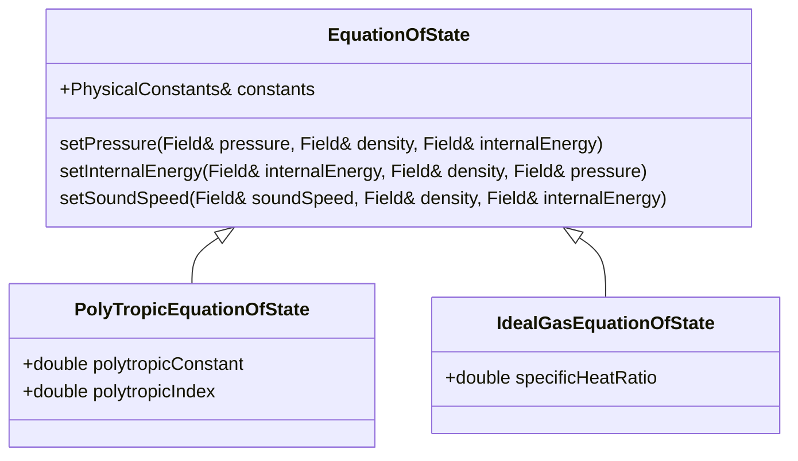

```mermaid
classDiagram
EquationOfState <|-- PolyTropicEquationOfState
EquationOfState <|-- IdealGasEquationOfState
EquationOfState : +PhysicalConstants& constants
EquationOfState : setPressure(Field& pressure, Field& density, Field& internalEnergy)
EquationOfState : setInternalEnergy(Field& internalEnergy, Field& density, Field& pressure)
EquationOfState : setSoundSpeed(Field& soundSpeed, Field& density, Field& internalEnergy)
class PolyTropicEquationOfState{
    +double polytropicConstant
    +double polytropicIndex
}
class IdealGasEquationOfState{
    +double specificHeatRatio
}
```