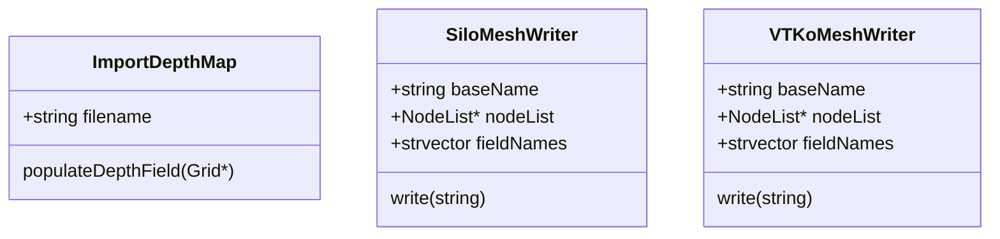

```mermaid
classDiagram
    class ImportDepthMap{
        +string filename
        populateDepthField(Grid*)
    }
    
    class SiloMeshWriter{
        +string baseName
        +NodeList* nodeList
        +strvector fieldNames
        write(string)
    }
    class VTKoMeshWriter{
        +string baseName
        +NodeList* nodeList
        +strvector fieldNames
        write(string)
    }
```