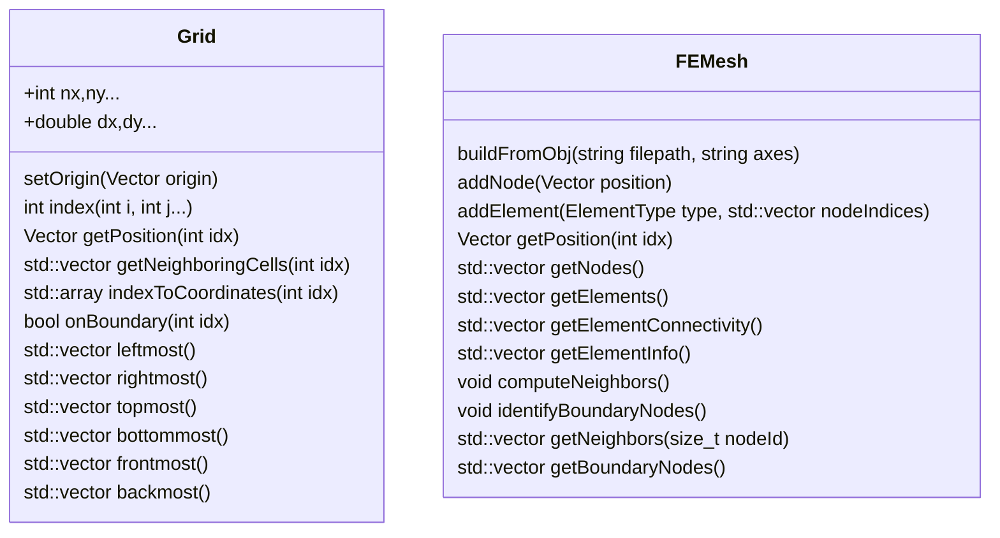

```mermaid
classDiagram
    class Grid{
        +int nx,ny...
        +double dx,dy...
        setOrigin(Vector origin)
        int index(int i, int j...)
        Vector getPosition(int idx)
        std::vector getNeighboringCells(int idx)
        std::array indexToCoordinates(int idx)
        bool onBoundary(int idx)

        std::vector leftmost()
        std::vector rightmost()
        std::vector topmost()
        std::vector bottommost()
        std::vector frontmost()
        std::vector backmost()
    }

    class FEMesh{
        buildFromObj(string filepath, string axes)
        addNode(Vector position)
        addElement(ElementType type, std::vector<size_t> nodeIndices)
        
        Vector getPosition(int idx)
        std::vector getNodes()
        std::vector getElements()
        std::vector getElementConnectivity()
        std::vector getElementInfo()
        void computeNeighbors()
        void identifyBoundaryNodes()
        std::vector<size_t> getNeighbors(size_t nodeId)
        std::vector<size_t> getBoundaryNodes()
    }
```