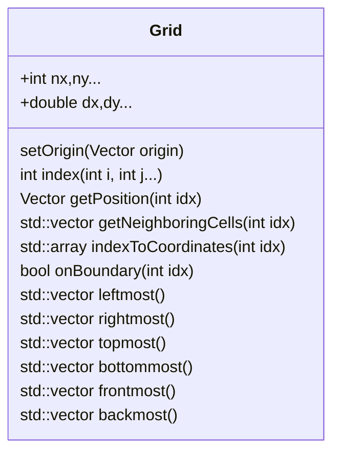

```mermaid
classDiagram
    class Grid{
        +int nx,ny...
        +double dx,dy...
        setOrigin(Vector origin)
        int index(int i, int j...)
        Vector getPosition(int idx)
        std::vector getNeighboringCells(int idx)
        std::array indexToCoordinates(int idx)
        bool onBoundary(int idx)

        std::vector leftmost()
        std::vector rightmost()
        std::vector topmost()
        std::vector bottommost()
        std::vector frontmost()
        std::vector backmost()
    }
```