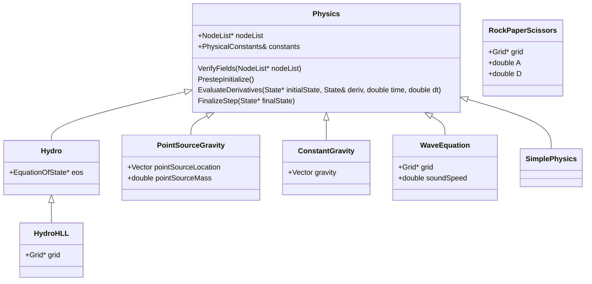

```mermaid
classDiagram
    Physics <|-- Hydro
    Physics <|-- PointSourceGravity
    Physics <|-- ConstantGravity
    Physics <|-- WaveEquation
    Physics : +NodeList* nodeList
    Physics : +PhysicalConstants& constants
    Physics : VerifyFields(NodeList* nodeList)
    Physics : PrestepInitialize()
    Physics : EvaluateDerivatives(State* initialState, State<dim>& deriv, double time, double dt)
    Physics : FinalizeStep(State* finalState)
    class PointSourceGravity{
        +Vector pointSourceLocation
        +double pointSourceMass
    }
    class ConstantGravity{
        +Vector gravity
    }
    class Hydro{
        +EquationOfState* eos
    }
    Physics <|-- SimplePhysics
    class SimplePhysics{
        
    }
    class WaveEquation{
        +Grid* grid
        +double soundSpeed
    }
    class RockPaperScissors{
        +Grid* grid
        +double A
        +double D
    }
    Hydro <| -- HydroHLL
    class HydroHLL{
        +Grid* grid
    }
```