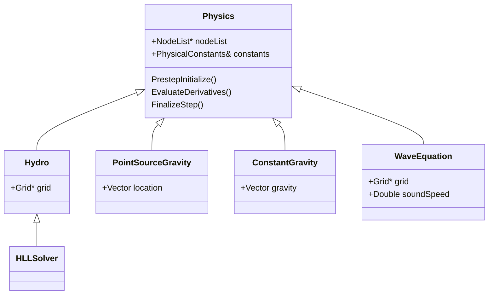

```mermaid
classDiagram
    Physics <|-- Hydro
    Physics <|-- PointSourceGravity
    Physics <|-- ConstantGravity
    Physics <|-- WaveEquation
    Physics : +NodeList* nodeList
    Physics : +PhysicalConstants& constants
    Physics : PrestepInitialize()
    Physics : EvaluateDerivatives()
    Physics : FinalizeStep()
    class PointSourceGravity{
      +Vector location
    }
    class ConstantGravity{
      +Vector gravity
    }
    class Hydro{
      +Grid* grid
    }
    class WaveEquation{
      +Grid* grid
      +Double soundSpeed
    }
    Hydro <| -- HLLSolver
```